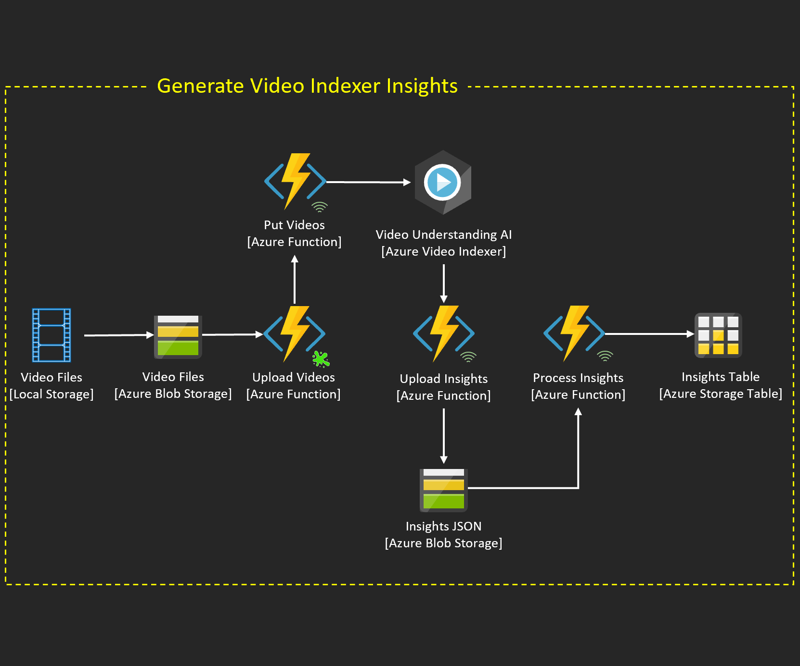

# Introduction 
Serverless automated metadata extraction pipeline from video files leveraging Azure Video Indexer.

Core Componets:
* [Azure Video Indexer](https://azure.microsoft.com/en-us/services/media-services/video-indexer/)
* [Azure Functions](https://azure.microsoft.com/en-us/services/functions/)
* [Azure Storage - Blob & Table](https://azure.microsoft.com/en-us/services/storage/)

TODO: Add features to DevOps
* [Azure LUIS - Language Understanding Intelligence Service](https://azure.microsoft.com/en-us/services/cognitive-services/language-understanding-intelligent-service/)
* [Azure Machine Learning](https://azure.microsoft.com/en-us/services/machine-learning/)

# Architecture Overview

# Getting Started
TODO: Guide users through getting your code up and running on their own system. In this section you can talk about:

## Prerequisites
* [Azure DevOps](https://docs.microsoft.com/en-us/azure/devops/user-guide/sign-up-invite-teammates?toc=%2Fazure%2Fdevops%2Fget-started%2Ftoc.json&bc=%2Fazure%2Fdevops%2Fget-started%2Fbreadcrumb%2Ftoc.json&view=azure-devops)
* [Azure Subscription](https://azure.microsoft.com/en-us/free/)
* [Azure Video Indexer](https://docs.microsoft.com/en-us/azure/media-services/video-indexer/connect-to-azure)

## Installation process
### Azure Resource Deployments
* [Deploy Azure Function](https://docs.microsoft.com/en-us/azure/azure-functions/)
    * Subscription: <your-azure-subscription>
    * Resource Group: <your-resource-group>
    * Function App Name: <your-function-app-name>
    * Runtimestack: Python
    * Version: 3.6
    * Region: <your-region> 
    * Storage account: <your-storage-account-0>
    * Operating system: Linux
    * Plan: Consumption (Serverless)
    * Enable Application Insights: Yes
    * Application Insights: <your-application-insights> 

* [Deploy Azure Storage Account](https://docs.microsoft.com/en-us/azure/storage/blobs/)
    * Subscription: <your-azure-subscription>
    * Resource Group: <your-resource-group>
    * Storage Account Name: <your-storage-account-1>
    * Location: <your-region>
    * Performance: Standard
    * Account kind: StorageV2 (general purpose v2)
    * Replication: RA-GRS
    * Access Tier (default): Hot
    * Connectivity Method: Public endpoint (all networks)
    * Routing preferences: Microsoft network routing (default)
    * Secure transfer required: Enabled
    * Azure Files: N/A
    * Blob soft delete: Disabled
    * Hierarchical namespace: Disabled

* [Deploy Azure Media Services](https://docs.microsoft.com/en-us/azure/media-services/latest/)
    * Account Name: <your-media-services-name>
    * Subscription: <your-azure-subscription>
    * Resource Group: <your-resource-group>
    * Location: <your-region>
    * Storage Account: <your-storage-account-1>

## Dependencies
### Import Repo into Azure DevOps
    * Import Repo into Azure DevOps
    * Select Pipelines
    * Select New pipeline
    * Select Azure Repos Git
    * Select <your-repo>
    * Select Python Function App to Linux on Azure
    * Select <your-azure-subscription> 
    * Select Continue
    * Select <your-function-app-name> 
    * Select Validate and configure
    * Select Run pipeline

### Create Content Container for Videos
    * Create new Azure Storage Container in <your-storage-account-1>
    * Container Name: <your-storage-container-name>
    * Public access level: Container (anonymous read access for container and blobs)
        * All container and blob data can be read by anonymous request. Clients can enumerate blobs within the container by anonymous request, but cannot enumerate containers within the storage account.

### Update Azure Function Application Settings
* Update <your-function-app-name> Application settings
* AF_PUTVIDEO_URL: <your-PutVideo-endpoint>
* SA_CONNX_STRING: <your-storage-account-1-connection-string>
* SA_TABLE_INSIGHTS: <your-table-insights-name>
* SA_TABLE_TRACKER: <your-table-tracker-name>
* VI_ACCOUNT_ID: <your-video-indexer-account-id>
* VI_CALLBACK_URL: <your-DownloadInsights-endpoint>
* VI_KEY: <your-video-indexer-key>
* VI_LOCATION: <your-video-indexer-region>

## Latest releases
## API references
    * [Video Indexer API](https://api-portal.videoindexer.ai/)

# Build and Test
* Approach 1: Upload videos to <your-storage-account-1>, pipeline will trigger automatically
* Approach 2: POST <your-PutVideo-endpoint>
		{'path': <your-blob-container-name>/<your-blob-full-path>
    		 'name': <your-blob-file-name>,
		 'uri': <your-blob-download-uri>}

* Validate processed videos in Video Indexer Portal.
* Validate AI automated generation of a dataset inside <your-storage-account-1> in <your-table-tracker-name>

# Contribute
Please contact James Tooles @ Microsoft.

If you want to learn more about creating good readme files then refer the following [guidelines](https://docs.microsoft.com/en-us/azure/devops/repos/git/create-a-readme?view=azure-devops). You can also seek inspiration from the below readme files:
- [ASP.NET Core](https://github.com/aspnet/Home)
- [Visual Studio Code](https://github.com/Microsoft/vscode)
- [Chakra Core](https://github.com/Microsoft/ChakraCore)